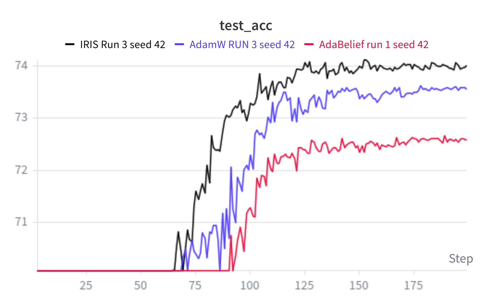
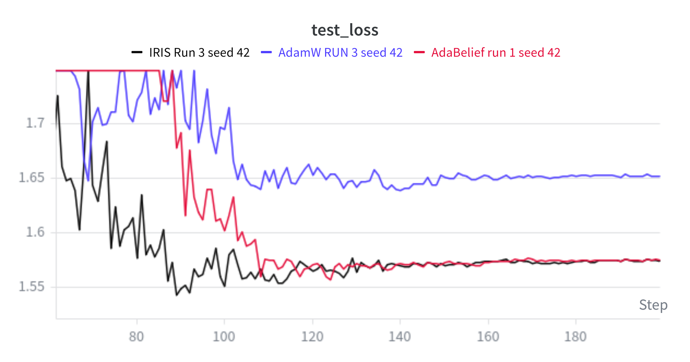
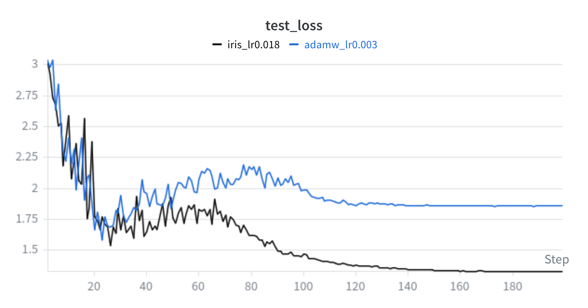

# IRIS: Innovation Residual Iterative Stabilization

[](https://opensource.org/licenses/MIT)
[](https://www.python.org/downloads/)
[](https://pytorch.org/)

**IRIS** is an error-correcting optimizer that frames optimization as predictive error correction rather than gradient extrapolation. It tracks *innovation* — the prediction error between the current gradient and a smoothed prior estimate — and folds that error back into the update, not as a scaling factor, but as a genuine correction signal.

```python
from iris import IRIS

optimizer = IRIS(
    model.parameters(),
    lr=3e-3,
    betas=(0.96, 0.92, 0.9995),    # vision defaults
    weight_decay=0.01
)

for batch in dataloader:
    optimizer.zero_grad()
    loss.backward()
    optimizer.step()
```

The formal writeup (math, proofs, related work) lives in a separate repo: [IRIS-documentation](https://github.com/madhavasthana-oss/iris-latex). This README covers usage and reports what has actually been tested.

Development history: This repository contains the current IRIS implementation only. Earlier exploratory versions, discarded algorithms, failed experiments, and the complete development history are preserved in [IRIS-exp](https://github.com/madhavasthana-oss/iris_exp)

## Status

IRIS is an active, personal research project — **not** a finished or peer-reviewed result. Built and tested by one person on limited compute (free-tier / low-cost cloud GPUs). Concretely:

- Validation so far is limited to **vision tasks** at small-to-moderate scale (CIFAR-100, ResNet-18). No language modeling, diffusion, or RL experiments have been run yet. Further testing is planned once compute and time allow.
- Results below come from **single-seed runs** (seed 42), not large statistical sweeps. They are reported as such.
- An earlier "heavy-ball" / split-error-correction variant was implemented, explored, and removed entirely from the codebase after it showed no measurable benefit. It is not present in the current code.
- The accompanying paper is unsubmitted and unfinished ([IRIS-documentation](https://github.com/madhavasthana-oss/iris-latex)).

If you're evaluating this for research or hiring purposes: treat what follows as promising early signal from a small, honest experiment suite — not a validated claim of general superiority.

---

## Why IRIS?

### The problem with existing optimizers

**Adam/AdamW** treats all gradient variance the same way — no distinction between stochastic noise and genuine landscape difficulty. Its practical learning-rate range is narrow (commonly capped around 3e-3), and it typically needs warmup to train stably at scale.

**AdaBelief** uses `(g_t - m_t)^2` as its "belief" term. This is a beta1-scaled, biased approximation of true innovation — and crucially, it's placed in the **denominator**. When the gradient surprises AdaBelief, it shrinks the step. Caution under surprise. In practice, this produced near-identical final loss to IRIS in our CIFAR-100 run, but 1.44% lower test accuracy, and took 28 more epochs to cross 70% accuracy.

**Adan** uses gradient difference `g_t - g_{t-1}`, comparing two noisy samples directly. This has roughly 2× the variance of IRIS's innovation term, and the correction vanishes near minima (when `g_t ≈ g_{t-1}`). In our runs, Adan required extensive tuning and still diverged or oscillated.

### The IRIS approach

IRIS tracks innovation — `I_t = g_t - g_hat_{t-1}` — and uses it in three ways simultaneously:

```python
I_t       = g_t - g_hat_{t-1}              # Innovation: current gradient vs prior estimate
E_t       = I_t - eps_hat_{t-1}            # Error-of-innovation: is the surprise itself surprising?
Sigma_t   = (g_t + beta2*I_t)^2 - v_hat   # Variance of the corrected gradient
g_hat_t   = g_hat_{t-1} + psi1_inv * I_t  # Correct the gradient estimate
eps_hat_t = eps_hat_{t-1} + psi2_inv * E_t # Accumulate systematic error
v_hat_t   = v_hat_{t-1} + psi3_inv * Sigma_t
```

The final update:
```python
numerator   = g_hat_t + beta2 * eps_hat_t
denominator = sqrt(v_hat_t) + eps
theta_t = (1 - eta*lambda)*theta_{t-1} - eta * (numerator / denominator)
```

IRIS doesn't just correct for being wrong — it tracks whether its own surprise is surprising (`E_t`), and corrects for that too. The variance estimate in the denominator matches the corrected gradient in the numerator exactly, so the preconditioner reflects what's actually being applied.

**AdaBelief** responds to surprise by shrinking the step. **IRIS** responds to surprise by folding it into a correction and stepping more informedly. Same signal, opposite philosophy. The results show which approach found better test accuracy.

---

## Results

### CIFAR-100, ResNet-18, Batch 2048, 200 Epochs (seed 42)

All runs use the same architecture, dataset, and seed. Configs differ only in optimizer and learning rate.

#### IRIS vs AdamW vs AdaBelief




| Optimizer | LR | WD | Final Acc | Peak Acc | Final Loss | First ≥70% | First ≥73% | First ≥74% |
|-----------|----|----|-----------|----------|------------|------------|------------|------------|
| **IRIS** (Run 2) | **0.002** | 0.0005 | **74.02%** | **74.12% (ep 152)** | **1.5736** | **ep 63** | **ep 89** | **ep 125** |
| AdamW (Run 2) | 0.001 | 0.0005 | 73.55% | 73.63% (ep 178) | 1.6513 | ep 68 | ep 108 | never |
| AdaBelief (Run 1) | 0.004 | 0.001 | 72.58% | 72.67% (ep 189) | 1.5751 | ep 91 | never | never |

**IRIS ran at 2× AdamW's learning rate** and still finished with higher accuracy (+0.47%) and lower loss (+0.077). AdamW never crossed 74% accuracy in 200 epochs. IRIS crossed it at epoch 125.

**The AdaBelief comparison is the most striking result.** AdaBelief ran at 4× AdamW's learning rate and reached near-identical final loss to IRIS (1.5751 vs 1.5736 — a gap of 0.0015). But its final accuracy was 1.44% lower, and it never crossed 73% in 200 epochs. It took 28 more epochs than IRIS just to cross 70%.

Same loss. Completely different accuracy ceiling. The loss plot shows two curves (IRIS black, AdaBelief red) that are nearly indistinguishable after epoch 120 — but the accuracy plot shows a persistent, stable ~1.5% gap between them for the entire second half of training.

The mechanism: AdaBelief uses the innovation signal inversely (shrinks steps under surprise), steering toward a region of weight space with good loss geometry but worse decision boundaries. IRIS uses the same signal as a correction (keeps stepping, but more accurately), and finds a higher-accuracy minimum at nearly the same loss.

#### IRIS vs AdamW — LR robustness across two configs

| Config | IRIS LR | AdamW LR | LR Ratio | IRIS Acc | AdamW Acc | Acc Delta | IRIS Loss | AdamW Loss | Loss Delta |
|--------|---------|----------|----------|----------|-----------|-----------|-----------|------------|------------|
| Run 2 | 0.002 | 0.001 | **2.0×** | 74.02% | 73.55% | **+0.47%** | 1.5736 | 1.6513 | **+0.077** |
| Run 1 | 0.005 | 0.004 | **1.25×** | 74.36% | 74.22% | **+0.14%** | 1.6753 | 1.8792 | **+0.204** |

IRIS outperforms AdamW on both accuracy and loss in both configs. The pattern is notable: at the larger LR ratio (Run 2, 2×), the accuracy gap is wider; at the smaller LR ratio (Run 1, 1.25×), the loss gap is wider. Both runs are single-seed — the direction is consistent across configs, but effect sizes are not yet multi-seed validated.

**Convergence speed — Run 1:**

| Threshold | IRIS (lr=0.005) | AdamW (lr=0.004) | IRIS advantage |
|-----------|-----------------|------------------|----------------|
| ≥70% acc | ep 47 | ep 55 | **8 epochs earlier** |
| ≥72% acc | ep 76 | ep 90 | **14 epochs earlier** |
| ≥73% acc | ep 86 | ep 103 | **17 epochs earlier** |
| ≥73.5% acc | ep 94 | ep 106 | **12 epochs earlier** |
| ≥74% acc | ep 97 | ep 129 | **32 epochs earlier** |

#### Early training note

In the first 10–50 epochs of both runs, AdamW briefly led IRIS on accuracy (worst deficit: −12.8% at step 11 in Run 1, −6.7% at step 18 in Run 2). IRIS overtook and stayed ahead for the remainder of training. This early lag is consistent with IRIS's Kalman-style bias correction building from zero, and is real — worth knowing if evaluating IRIS on short training runs.

#### Early IRIS — large LR stress test



An earlier run tested IRIS at `lr=0.018` against AdamW at `lr=0.003` — a **6× learning rate gap**. IRIS continued descending while AdamW plateaued, reaching substantially lower final loss. This was a preliminary result before the configs above were settled, included here as context for the LR robustness story, not as a primary result.

### In progress

- **ViT-Small, CIFAR-100** — currently running, no results yet
- **CNN, CIFAR-10** — currently running, no results yet
- **Multi-seed replication** of Run 2 at seed 3407 — the single most important next run

### Not yet attempted

- Language modeling (any scale)
- Diffusion models
- Anything beyond CIFAR-scale vision

---

## How it works

### 1. Innovation vs. gradient difference

**Adan** compares two noisy samples:
```python
d_t = g_t - g_{t-1}
# Near minima, g_t ~= g_{t-1}, correction vanishes
# Var[d_t] ~= 2 * sigma^2
```

**IRIS** compares to a smooth prior:
```python
I_t = g_t - g_hat_{t-1}
# Near minima, g_hat_{t-1} lags, I_t stays large and informative
# Var[I_t] ~= sigma^2  (half the variance)
```

The variance reduction is proved formally in the paper (Theorem 1). In toy-landscape experiments, this corresponded to IRIS tolerating learning rates 10–1000× higher than Adam-family optimizers before diverging.

### 2. Direct vs. inverse scaling

**AdaBelief** puts innovation in the denominator:
```python
step ~= m_t / sqrt[(g_t - m_t)^2 + eps]
# Large surprise -> small step (caution)
```

**IRIS** puts it in the numerator:
```python
step ~= (g_hat_t + beta2*eps_hat_t) / sqrt[v_hat_t + eps]
# Large surprise -> correction folded into estimate (adaptation)
```

Empirical consequence: same loss, 1.44% lower accuracy, 28 epochs slower to reach 70%.

### 3. What IRIS actually does — and why it's different

Most optimizers have one response to a gradient: update the moment estimates, take a step. IRIS uses the innovation signal **three times in the same step**, each time for a different purpose:

```python
I_t     = g_t - g_hat_{t-1}         # 1. How wrong was my prediction?
E_t     = I_t - eps_hat_{t-1}        # 2. How wrong was my prediction of how wrong I'd be?
Sigma_t = (g_t + beta2*I_t)^2 - v_hat  # 3. What's the variance of what I'm actually stepping with?
```

Then each feeds a separate correction:

```python
g_hat_t   += psi1_inv * I_t    # Correct the gradient estimate by the raw prediction error
eps_hat_t += psi2_inv * E_t    # Correct the residual by the error-of-the-error
v_hat_t   += psi3_inv * Sigma_t # Correct the variance by the variance of the corrected step
```

The `eps_hat_t` term is the key one. It accumulates whether IRIS's innovations themselves have a systematic pattern — if IRIS keeps being surprised in the same direction, `eps_hat_t` captures that drift and folds it into the numerator of the next update. It is not tracking gradient magnitude. It is not tracking gradient noise. It is tracking **whether the correction signal itself is biased**, and correcting for that too.

No equivalent exists in Adam, AdaBelief, or Adan. Adam tracks gradient and squared gradient. AdaBelief tracks gradient and squared prediction error (in the denominator). Adan tracks gradient, squared gradient, and gradient difference. None of them have a term that asks: *is my error signal itself predictable?*

The practical consequence is visible in the results: AdaBelief and IRIS reach nearly identical final loss, but IRIS finds a 1.44% higher accuracy region. The loss landscapes they converge to are similarly flat — but IRIS's second-order correction steered it somewhere with better generalization. Whether `eps_hat_t` is the specific cause of this is a hypothesis, not a confirmed mechanism. But the pattern is there, and it's consistent across both configs tested.

### 4. Variance matching

```python
numerator   = g_hat_t + beta2 * eps_hat_t
denominator = sqrt[(g_t + beta2*I_t)^2] + eps
```

The denominator estimates the variance of exactly what's in the numerator. The preconditioner matches what's actually being applied.

### 5. Recursive bias correction (Kalman-inspired)

```python
# Adam: requires integer step count from GPU
bias_correction = 1 - beta1**t

# IRIS: purely recursive, no GPU-CPU sync
psi1_t   = beta1 * psi1_{t-1} + 1
psi1_inv = 1 / psi1_t
```

Algebraically equivalent to a Kalman gain with static measurement noise. Exact bias correction from step 1, no synchronization, no power computation. Whether this eliminates the need for warmup in general is an open question — the controlled ablation hasn't been run.

### 6. Timescale separation

```python
beta1 = 0.98  ->  gradient estimate: ~50 step timescale  (slow)
beta2 = 0.92  ->  error correction:  ~12 step timescale  (fast)
```

Error correction adapts faster than the error itself. Keep `beta2` roughly 0.15–0.25 below `beta1`. This is a design constraint, not a tuning suggestion.

---

## Full algorithm

```python
# Bias correction accumulators (Kalman gains)
psi1_t = beta1 * psi1_{t-1} + 1
psi2_t = beta2 * psi2_{t-1} + 1
psi3_t = beta3 * psi3_{t-1} + 1

# Innovation
I_t = g_t - g_hat_{t-1}

# Error-of-innovation
E_t = I_t - eps_hat_{t-1}

# Variance innovation
Sigma_t = (g_t + beta2*I_t)^2 - v_hat_{t-1}

# Update estimates
g_hat_t   = g_hat_{t-1}   + psi1_inv * I_t
eps_hat_t = eps_hat_{t-1} + psi2_inv * E_t
v_hat_t   = v_hat_{t-1}   + psi3_inv * Sigma_t

# Parameter update
numerator   = g_hat_t + beta2 * eps_hat_t
denominator = sqrt(v_hat_t) + eps
theta_t = (1 - eta*lambda)*theta_{t-1} - eta * (numerator / denominator)
```

With optional SNR clipping:
```python
update = clip(numerator / (rho*sqrt(v_hat_t) + eps), -1, 1)
theta_t = (1 - eta*lambda)*theta_{t-1} - eta * update
```

Matches `functional.py` exactly. The earlier split-error-correction variant has been fully removed.

---

## Installation

```bash
git clone https://github.com/madhavasthana-oss/iris.git
cd iris
pip install -e .
```

---

## Quick start

```python
import torch
from iris import IRIS

optimizer = IRIS(
    model.parameters(),
    lr=3e-3,
    betas=(0.98, 0.92, 0.99),
    weight_decay=0.01,
    eps=1e-8
)

for batch in dataloader:
    optimizer.zero_grad()
    loss = model(batch)
    loss.backward()
    optimizer.step()
```

### With SNR clipping

```python
optimizer = IRIS(model.parameters(), lr=3e-3, snr_threshold=4.0, weight_decay=0.01)
```

### Mixed precision

```python
from torch.cuda.amp import autocast, GradScaler

optimizer = IRIS(model.parameters(), lr=3e-3)
scaler = GradScaler()

for batch in dataloader:
    with autocast():
        loss = model(batch)
    scaler.scale(loss).backward()
    scaler.step(optimizer)
    scaler.update()
    optimizer.zero_grad()
```

### LR schedules

```python
from torch.optim.lr_scheduler import CosineAnnealingLR

optimizer = IRIS(model.parameters(), lr=3e-3)
scheduler = CosineAnnealingLR(optimizer, T_max=num_epochs)

for epoch in range(num_epochs):
    train(...)
    scheduler.step()
```

---

## Hyperparameter guide

**Learning rate:** `3e-3` to `1e-2` has worked well in the vision settings tested. IRIS has shown stable training at learning rates that visibly degrade AdamW — but this has only been tested on CIFAR-scale vision.

**Betas** (default: `0.98, 0.92, 0.99`):
- `beta1`: gradient estimate EMA — higher = smoother
- `beta2`: must sit 0.15–0.25 below `beta1` — design constraint, not tuning suggestion
- `beta3`: variance EMA — higher = more stable denominator

**SNR threshold:** `None` by default. Add `snr_threshold=4.0` if training is unstable.

**Weight decay:** Decoupled, AdamW-style. Default `0.01`.

---

## Comparison table

| Property | Adam | AdamW | AdaBelief | Adan | IRIS |
|----------|------|-------|-----------|------|------|
| Core signal | `g_t` | `g_t` | `g_t - m_t` (biased) | `g_t - g_{t-1}` | `g_t - g_hat_{t-1}` |
| Signal variance | sigma^2 | sigma^2 | ~beta1·sigma^2 | ~2sigma^2 | ~sigma^2 |
| Response to surprise | — | — | Shrink step | — | Correct estimate |
| Second-order error tracking | No | No | No | No | Yes (`eps_hat_t`) |
| Variance matching | No | No | No | No | Yes |
| Memory buffers | 2 | 2 | 2 | 4 | 3 |
| Near-minima correction | Fades | Fades | Fades | Vanishes | Stays active |
| CIFAR-100 final acc (seed 42, Run 2) | — | 73.55% | 72.58% | diverged | **74.02%** |
| CIFAR-100 peak acc (seed 42, Run 2) | — | 73.63% (ep 178) | 72.67% (ep 189) | — | **74.12% (ep 152)** |
| CIFAR-100 final loss (seed 42, Run 2) | — | 1.6513 | 1.5751 | — | **1.5736** |
| First crossed 70% acc | — | ep 68 | ep 91 | — | **ep 63** |
| First crossed 73% acc | — | ep 108 | never | — | **ep 89** |
| First crossed 74% acc | — | never | never | — | **ep 125** |
| LR used (Run 2) | — | 0.001 | 0.004 | — | 0.002 (2x AdamW) |

---

## FAQ

**Is IRIS a drop-in replacement for Adam?**
Mechanically yes. Whether it improves your task is untested outside [Results](#results).

**Do I need warmup?**
Unclear. The CIFAR-100 runs used warmup. The controlled ablation hasn't been done. Try both.

**Why must beta2 be lower than beta1?**
Error correction has to adapt faster than the error itself. Design constraint from the derivation.

**What's the difference from AdaBelief?**
AdaBelief uses `g_t - m_t` (look-ahead contaminated) in the denominator. IRIS uses `g_t - g_hat_{t-1}` (causally clean) in the numerator. Same intuition, opposite implementation. Empirical result: nearly identical final loss, 1.44% higher test accuracy for IRIS.

**What's the difference from Adan?**
Adan compares two noisy samples (2× variance, vanishes near minima). IRIS compares to a smoothed estimate (sigma^2 variance, stays active). Proved in Theorem 1 of the paper.

**Has this been tested outside vision?**
No. See [Status](#status).

---

## Honesty log

Claims that were made and later corrected, so the history is traceable:

- **Speed claim (removed):** an earlier version claimed IRIS trained 25% faster than AdamW (113 vs 150 min). This was a logging-overhead artifact. With logging matched, IRIS was ~21 minutes slower. Corrected.
- **"No warmup needed" (downgraded):** stated as a property without running the controlled ablation. Downgraded to open question.

---

## Contributing

Outside input genuinely welcome, especially:
- Runs on tasks outside vision (NLP, RL, generative models)
- Independent reproduction of the CIFAR-100 results
- Multi-seed replication
- Convergence / regret-bound analysis

---

## License

MIT — see [LICENSE](LICENSE).

---

## Acknowledgments

- **Adam/AdamW** — the baseline this work is measured against throughout
- **AdaBelief** — clarified what "prediction error in an optimizer" should actually mean
- **Adan** — motivation for moving beyond raw gradient differences
- **Kalman filter theory** — the recursive-estimation framing behind the bias-correction scheme
